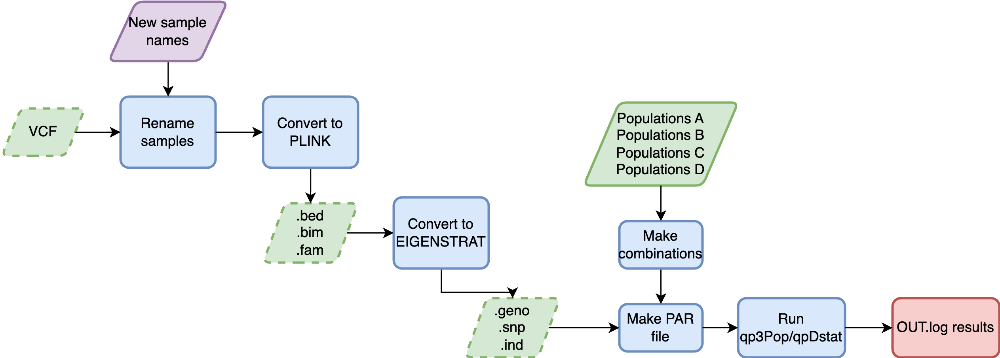

# run_admixtools

Nextflow pipeline (DSL2) that runs fstatistics with AdmixTools, taking different input types (VCF, PLINK, EIGENSTRAT).

---

### Workflow overview
 

---


### Features
  **-v 0.1.0**

* Supports compressed VCF file as input.
* Supports PLINK files as input.
* Supports EIGENSTRAT files as input.
* Option to run qpDstat for D or f4.
* Option to run qp3Pop for inbreed or outgroup.
* Makes all possible combination of treest for testing.
* Scalability and reproducibility via a Nextflow-based framework.

---

## Requirements
#### Compatible OS*:
* [Ubuntu 20.04.4 LTS](https://releases.ubuntu.com/focal/)
* macOS

#### Software:
| Requirement | Version  | Required Commands * |
|:---------:|:--------:|:-------------------:|
| [bcftools](https://samtools.github.io/bcftools/) | 1.17 | reheader,view |
| [Nextflow](https://www.nextflow.io/docs/latest/getstarted.html) | 23.04.2.5870 | nextflow |
| [plink](https://www.cog-genomics.org/plink/1.9/) | 1.19 ) | plink |
| [trident](https://www.poseidon-adna.org/#/trident) | v1.4.0.2 | Rscript |
| [AdmixTools](https://github.com/DReichLab/AdmixTools) | v651 and v980 | qp3Pop and qpDstat |

\* These commands must be accessible from your `$PATH` (*i.e.* you should be able to invoke them from your command line).  

---

### Installation
Download nf-haplotype-selection from Github repository:  
```
git clone https://github.com/jbv2/run_admixtools.git
```

---

#### Test
To test `run_admixtools` execution using test data, run:
```bash
nextflow run main.nf -profile <test_qpDstat,test_qp3Pop>
```

This pipeline can use nf-core Institutional profiles. For DAG EVA people, please use:
```bash
nextflow run main.nf -profile eva,archgen,<test_qpDstat,test_qp3Pop>
```

---

### Usage
To run `run_admixtools` go to the pipeline directory and execute:
```bash
nextflow run main.nf  --inputVCF <path to VCF input> --inputbed <path to PLINK bed> --inputgeno <Path to EIGENSTRAT geno> --input_type <'vcf','plink','eigenstrat'> --half_call <h> --popA <Vector for populations in A position> --popB <Vector for populations in B position>  --popC <Vector for populations in C position> --popD <Vector for populations in D position>  --run_qpDstat <true,false> --run_qp3Pop <true,false> --f4mode <"YES","NO"> --inbreed <"YES","NO"> --outdir <path to results> --samples <Path to file with new sample names>
```

If you have one input type, you don't need to provide the others. 

---

### Pipeline Inputs

1. If you have a VCF to start: 
* A `VCF` file compressed with a `.vcf.gz` extension. A `VCF` file mainly contains meta-information lines, a header and data lines with information about each position. The header names the eigth mandatory columns `CHROM, POS, ID, REF, ALT, QUAL, FILTER, INFO`. 


For more information about the VCF format, please go to the next link: [Variant Call Format](https://www.internationalgenome.org/wiki/Analysis/Variant%20Call%20Format/vcf-variant-call-format-version-40/)

Example line(s):
```bash
##fileformat=VCFv4.2
#CHROM	POS	ID	REF	ALT	QUAL	FILTER	INFO	FORMAT	sample1	sample2	sample3
21      9411773 rs867796868     C       T       .       PASS    AC=0;AN=182     GT      0|0     0|0     0|0     0|0
21      10979896        rs117219976     A       G       .       PASS    AC=1;AN=182     GT      0|1     0|0     0|0
22      17176028        rs2845365       T       G       .       PASS    AC=58;AN=182    GT      1|0     0|0     0|1 
```

* A two columns file, separated by space with old_name new_name.
```bash
sample1 FAM1_sample1
sample2 FAM2_sample2
sample3 FAM3_sample3
```

2. If you have bfile (PLINK) to start: 
* A binary `.bed`.
* A `.bim` file.

Example line(s):

```bash
1       rs74512038      0       778597  T       C
1       rs553642122     0       790021  T       C
1       rs4951859       0       794299  G       C
...
```
* A `.fam` file.

Example line(s):

```bash
FAM1 sample1        0       0       0       -9
FAM2 sample2        0       0       0       -9
FAM3 sample3        0       0       0       -9
...
```

3. If you have EIGENSTRAT to start: 
* A binary `.geno`.
* A `.snp` file.

Example line(s):

```bash
rs74512038       1      0       778597  T       C
rs553642122       1     0       790021  T       C
rs4951859       1       0       794299  G       C
...
```

* A `.ind` file.

Example line(s):

```bash
sample1 U FAM1
sample2 U FAM2
sample3 U FAM3
...
```

### Pipeline Results
> For qp3Pop

* A `.OUT.log` file.

Example line(s):

```bash
qp3Pop: parameter file: test.parfile
### THE INPUT PARAMETERS
##PARAMETER NAME: VALUE
genotypename: test.geno
snpname: test.snp
indivname: test.ind
popfilename: test.ftest.txt
inbreed: YES
## qp3Pop version: 651
inbreed set YES
test.snp: genetic distance set from physical distance
*** warning: first snp . is number.  perhaps you are using .map format
number of triples 3
nplist: 3
snps: 59920
number of blocks for block jackknife: 9
                      Source 1             Source 2               Target           f_3       std. err           Z    SNPs
 result:                   CHB                  PEL                 Maya      0.001641       0.011348       0.145   53604
```

* A `.ftest.txt` file with combinations.

Example line(s):

```bash
CHB	PEL	Maya
CHB	PEL	Mixe
CHB	PEL	Nahua
```
* A `.parfile` file.

Example line(s):

```bash
genotypename: test.geno
snpname: test.snp
indivname: test.ind
popfilename: test.ftest.txt
inbreed: YES
```

> For qpDstat
* A `.OUT.log` file.

Example line(s):

```bash
qpDstat: parameter file: test.parfile
### THE INPUT PARAMETERS
##PARAMETER NAME: VALUE
genotypename: test.geno
snpname: test.snp
indivname: test.ind
popfilename: test.ftest.txt
printsd: YES
f4mode: YES
## qpDstat version: 980
inbreed set NO
test.snp: genetic distance set from physical distance
*** warning: first snp . is number.  perhaps you are using .map format
number of quadruples 6
  0                  CHB    1
  1                  PEL    4
  2                 Maya    4
  3                 Mixe    5
  4                Nahua   13
jackknife block size:     0.050
snps: 59920  indivs: 27
number of blocks for block jackknife: 9
nrows, ncols: 27 59920
result:        CHB        PEL       Maya       Mixe     -0.000913      0.003262    -0.280    3756   3811  59905 
result:        CHB        PEL       Maya      Nahua      0.002345      0.002936     0.799    3875   3734  59905 
result:        CHB        PEL       Mixe       Maya      0.000913      0.003262     0.280    3811   3756  59905 
```

* A `.result.tsv` with header and separated by TAB.
```bash
PopA	PopB	PopC	PopD	f4	stderr	Zscore
CHB	PEL	Maya	Mixe	-0.000913	0.003262	-0.280
CHB	PEL	Maya	Nahua	0.002345	0.002936	0.799
CHB	PEL	Mixe	Maya	0.000913	0.003262	0.280
CHB	PEL	Mixe	Nahua	0.003258	0.001824	1.787
CHB	PEL	Nahua	Maya	-0.002345	0.002936	-0.799
CHB	PEL	Nahua	Mixe	-0.003258	0.001824	-1.787
```

* A `.ftest.txt` file with combinations.

Example line(s):

```bash
CHB	PEL	Maya	Mixe
CHB	PEL	Maya	Nahua
CHB	PEL	Mixe	Maya
CHB	PEL	Mixe	Nahua
CHB	PEL	Nahua	Maya
CHB	PEL	Nahua	Mixe
```
* A `.parfile` file.

Example line(s):

```bash
genotypename: test.geno
snpname: test.snp
indivname: test.ind
popfilename: test.ftest.txt
printsd:  YES
f4mode: YES
```

---

#### References
Under the hood `run_admixtools` uses some coding tools, please include the following ciations in your work:

* Narasimhan, V., Danecek, P., Scally, A., Xue, Y., Tyler-Smith, C., & Durbin, R. (2016). BCFtools/RoH: a hidden Markov model approach for detecting autozygosity from next-generation sequencing data. Bioinformatics, 32(11), 1749-1751.
* Patterson, Nick, et al. "Ancient admixture in human history." Genetics 192.3 (2012): 1065-1093.
* Purcell, S., Neale, B., Todd-Brown, K., Thomas, L., Ferreira, M. A., Bender, D., ... & Sham, P. C. (2007). PLINK: a tool set for whole-genome association and population-based linkage analyses. The American journal of human genetics, 81(3), 559-575.
* https://github.com/poseidon-framework/poseidon-hs


---

### Contact
If you have questions, requests, or bugs to report, please email <judith.vballesteros@gmail.com> 

#### Dev Team
Judith Ballesteros-Villascán <judith.vballesteros@gmail>