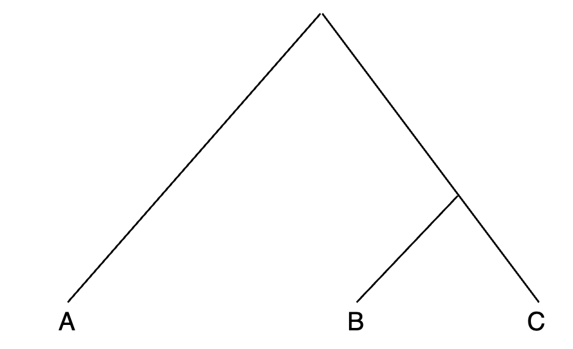

# nf-module:make_combinations_qp3Pop
**Author(s):**

* Judith Ballesteros Villascán (judith.vballesteros@gmail.com)

**Date:** November 2023

---

## Module description:
Considering the following tree:


Module takes a vector of populations for each position in the tree (A,B,C) and make all possible combinations to test it.

## Module Dependencies:
NONE

### Input(s):

Populations as parameters.

### Outputs:

* A `.ftest.txt` file with combinations.

Example line(s):

```bash
CHB	PEL	Maya
CHB	PEL	Mixe
CHB	PEL	Nahua
```

## Module parameters:
A vector for each position in the tree.

Example line(s):

```bash
popA="CHB"
popB="PEL"
popC="Maya Mixe Nahua"
```

